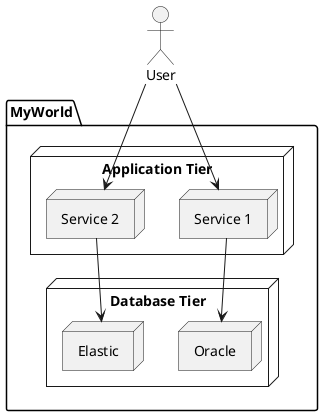
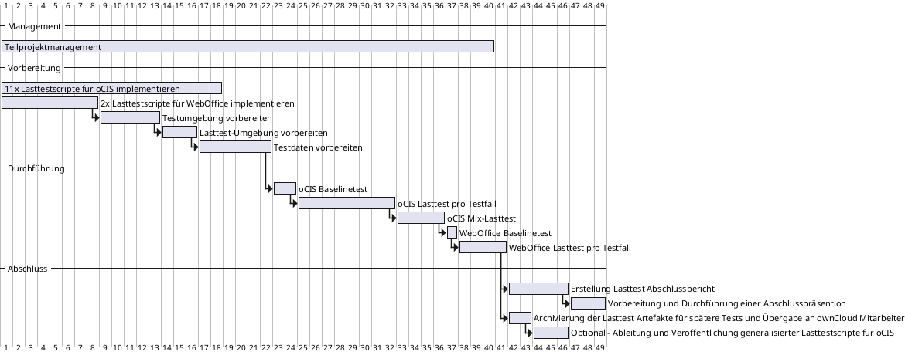

# Titel

_Datum - Ort - Author_

## Überschrift 1

`So kannst Du bspw. ein Stück Software-Code darstellen`

_Abbildung: Software-Code_

## Überschrift 2

_Abbildung: So bindet Du eine Grafik ein_

## Überschrift 2

_Abbildung: Schreib nicht so viel und "male" doch mal öfter was_

## Überschrift 3

| Spalte A | Spalte B | Spalte C |
| -------- | -------- | -------- |
| 1        | 2        | 3        |
| x        | xx       | xxx      |

_Tabelle: So kannst Du eine Tabelle integrieren_

<table>
    <th>Spalte A</th>
    <th>Spalte B</th>
    <th>Spalte C</th>
    <tr>
        <td>A</td>
        <td>B</td>
        <td>C</td>
    </tr>
    <tr>
        <td>1</td>
        <td>2</td>
        <td>3</td>
    </tr>
    <tr>
        <td>x</td>
        <td>xx</td>
        <td>xxx</td>
    </tr>
</table>

_Tabelle: So kannst Du auch eine Tabelle integrieren_
