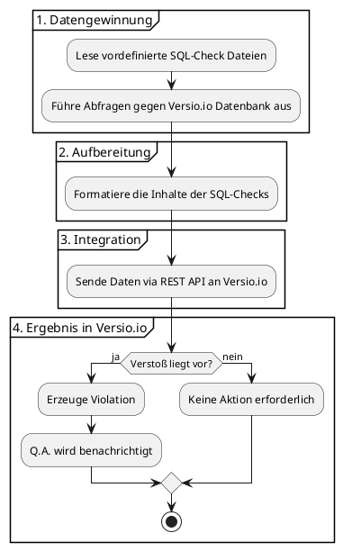
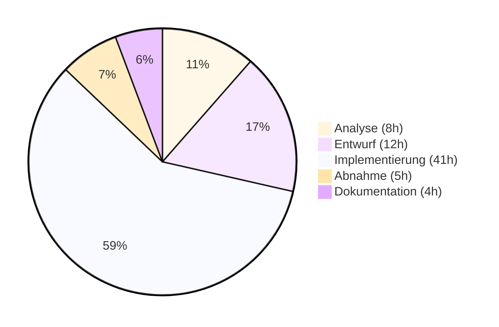

# Beantragung der betrieblichen Projektarbeit

## 1. Projektbezeichnung

Qualitätsprüfungssystem für den Versio.io Produktlebenszyklus und Schwachstellen Datenbankkontent

### 1.1. Kurzform der Aufgabenerstellung

Versio.io (ein Softwareprodukt von QMETHODS – Business & IT Consulting GmbH) ist eine Plattform, die die gesamte IT-Landschaft eines Unternehmens inventarisiert. Basierend auf dieser digitalen Nachbildung (Digital Twin) werden alle Änderungen erkannt und können im Hinblick auf IT-Governance und Sicherheit bewertet werden. Neben anderen Funktionen bietet Versio.io auch eine Bewertung des Lebenszyklus und der Sicherheit von Software- und Hardware Produkten.

Nun soll für die Versio.io ein automatisiertes System zur Datenqualitätsprüfung entwickelt werden, das die manuelle Überprüfung der Datenqualität in der Versio.io-Datenbank für End-of-Life und Schwachstellen ersetzt. Die Datenbank verwaltet Produktversionen, deren Wartungs- und Support-Zeiträume sowie Schwachstellen (CVE) für Tausende von Software- und Hardware Produkten.

Das System führt SQL-basierte Qualitätsprüfungen gegen Versio.io Datebabk durch, bereitet die Ergebnisse strukturiert auf und meldet Qualitätsprobleme über eine REST-API an Versio.io.

---

## 2. Ist-Analyse

Versio.io betreibt eine komplexe Datenbank mit Produktlebenszyklus-Informationen, Schwachstellen (CVE), die kontinuierlich durch verschiedene Datenquellen (GitHub, US National Vulnerability Database (NVD), Red Hat usw.) aktualisiert wird. Die Datenbank dient Kunden-Unternehmen zur Überwachung der Sicherheit und des Lebenszyklus ihrer IT-Produkte.

Derzeit erfolgt die Datenqualitätsprüfung manuell, was folgende aufwand verursacht:

* Zeit: Manuelle Überprüfung großer Datenmengen dauert mehrere Stunden täglich
* Fehleranfälligkeit: Menschliche Fehler bei der Identifikation von Dateninkonsistenzen
* Skalierungsprobleme: Mit wachsender Datenbank wird manuelle Prüfung zunehmend ineffizient
* Inkonsistenz: Unterschiedliche Prüfkriterien je nach bearbeitendem Entwickler
* Verzögerte Problemerkennung: Qualitätsprobleme werden oft erst spät entdeckt
* Hoher Personalaufwand: Entwickler sind täglich mit manuellen Prüfungen beschäftigt

---

## 3. Zielsetzung/Soll Konzept

### 3.1. Was soll am Ende des Projekts erreicht sein?

Das primäre Projektziel ist die Implementierung eines vollautomatisierten Systems zur Datenqualitätsprüfung das eine Überwachung und Berichterstattung gewährleistet. Das System führt SQL-basierte Prüfroutinen eigenständig aus und bereitet die Ergebnisse in einer einheitlich strukturierten Form auf.

Ein zentraler Bestandteil ist die direkte Anbindung an die Versio.io-Plattform via API, wodurch identifizierte Qualitätsprobleme ohne manuelles Eingreifen gemeldet werden. Um dabei die Systemstabilität zu wahren, sorgt ein integriertes Rate-Limiting für eine kontrollierte Ausführung der API-Aufrufe.

Die technische Robustheit wird durch ein Logging aller Prüfvorgänge sowie eine dedizierte Fehlerbehandlung für Datenbank- und Schnittstellenkonflikte sichergestellt. Durch die Umsetzung des Projekts soll die manuelle Datenqualitätsprüfung reduziert werden, was zu erheblichen Zeit- und Kosteneinsparungen führt.

### 3.2. Welche Anforderungen müssen erfüllt sein?

Funktionale Anforderungen:
* Ausführung von SQL-Queries aus konfigurierbaren SQL-Dateien
* Verarbeitung von Prüfergebnissen mit Parallelverarbeitung
* Generierung und zuschicken von Links für die betroffenen Produkte an die Versio.io API, wenn so im SQL bestimmt
* Gesicherte API-Aufrufe an Versio.io Platform mithilfe von Umgebungsvariabeln
* Textbereinigung fur die Beschreibungstext im SQL, damit sie auf Versio.io Oberfläche richtig generieret werden
* Error-Handling für fehlgeschlagene SQL-Queries und API-Aufrufe
* Rate-Limiting für API-Aufrufe, um das Server nicht zu belasten.

Nicht-funktionale Anforderungen:
* Verarbeitung von den Gesamten SQL-checks in unter 10 Minuten
* 99%+ Erfolgsrate bei API-Übertragungen
* Vollständige Fehlerbehandlung und Recovery-Mechanismen
* Ausführliche Logging-Funktionalität mit strukturierten Ausgaben
* Modulare Architektur und Aufgabentrennung für einfache Erweiterung und Wartung
* Integration in bestehende Versio.io Pipeline-Struktur

Technische Anforderungen:
* JavaScript/Node.js als Programmiersprache
* MariaDB für Datenzugriff über connectionPool
* REST-API-Integration für Versio.io
* JSON als Datenformat
*  Nutzung von Umgebungsvariablen für Datenbankzugriff und API

### 3.3. Welche Einschränkungen müssen berücksichtigt werden?

Die bestehenden Datenbankoperationen von der Platform und die allgemeine Verfügbarkeit Versio.io haben dabei zu jeder Zeit Vorrang. Technisch soll sich die Lösung problemlos in die aktuelle MariaDB-Infrastruktur integrieren und direkt in die vorhandene Pipeline-Struktur eingegliedert.

Ein zentraler Aspekt soll die Wahrung der Systemstabilität sein: Mithilfe von der Einhaltung der maximalen Request-Raten und eine nicht-belastende Abfragelogik soll sicher gemacht werden, das weder die erhaltende API noch die kritische Produktionsdatenbank übermäßig belastet werden.

Außerdem  liegt ein besonderes Wert auf der Sicherheit, insbesondere bei der geschützten Handhabung von API-Token und Datenbank-Zugangsdaten, um die Integrität der gesamten Umgebung nicht zu komprimieren. Dies muss durch Umgebungsvariablen realisiert werden, und nicht direkt in den code geschreiben werden.

---

## 4. Projektstrukturplan mit Zeitplanung

| Phase | Aufgabe | Aufwand (h) | Summe (h) |
| --- | --- | --- | --- |
| **Analyse** | Analyse der Pipeline-Struktur und Architektur | 2 | **8** |
|  | Analyse der API-Schnittstelle und Anforderungen | 2 |  |
|  | Definition des standardisierten SQL-Formats | 2 |  |
|  | Erstellung des Lastenhefts | 2 |  |
| **Entwurf** | Entwurf des Aktivitätsdiagramms (DQ-Prüfung) | 2 | **12** |
|  | Entwurf Datenbank-Anbindung & Connection-Pooling | 2 |  |
|  | Ausarbeitung der Rate-Limiting-Strategie | 2 |  |
|  | Entwurf API-Integration & Error-Handling | 4 |  |
|  | Erstellung des Pflichtenhefts | 2 |  |
| **Implementierung** | Erstellung der Struktur in bestehender Pipeline | 2 | **41** |
|  | Implementierung Datenbank-Anbindung (Pool) | 3 |  |
|  | Entwicklung SQL-Dateisystem-Scanner | 3 |  |
|  | Realisierung paralleler Prozessor für API-Calls | 3 |  |
|  | Sicherstellung des Rate-Limiting-Mechanismus | 3 |  |
|  | Implementierung Logik zur Ergebnisformatierung | 3 |  |
|  | Entwicklung API-Schnittstelle (PUT-Requests) | 5 |  |
|  | Implementierung robustes Fehlerhandling (Try-Catch) | 3 |  |
|  | Integration strukturiertes Logging | 3 |  |
|  | Erstellung Shell-Skript-Wrapper (main.sh) | 2 |  |
|  | Konfiguration Umgebungsvariablen & Tokens | 2 |  |
|  | Code-Refactoring & Performance-Optimierung | 4 |  |
|  | Erstellung Beispiel-SQL-Queries & Tests | 5 |  |
| **Abnahme** | Code-Review durch das Entwicklungsteam | 2 | **5** |
|  | Abnahme durch Projektverantwortliche | 1 |  |
|  | Erfolgskontrolle in der Entwicklungsumgebung | 1 |  |
|  | Platzierung in die bestehende Pipeline | 1 |  |
| **Dokumentation** | Erstellung der Projektdokumentation | 2 | **4** |
|  | Schreibung der Entwicklerdokumentation | 1 |  |
|  | Erfassung der Benutzerhandbuchs | 1 |  |
| **Gesamt** |  |  | **70** |

## 5. Name des Ausbilders, bzw. Projektverantwortlichen

