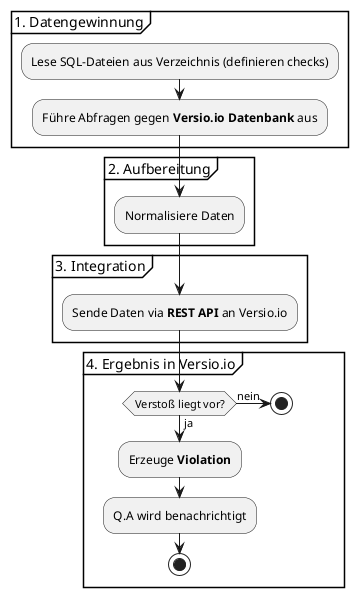

# Beantragung der betrieblichen Projektarbeit

## 1. Projektbezeichnung

Qualitätsprüfungssystem für den Versio.io Produktlebenszyklus und Schwachstellen Datenbankkontent

### 1.1. Kurzform der Aufgabenerstellung

Versio.io (ein Softwareprodukt von QMETHODS – Business & IT Consulting GmbH) ist eine Plattform, die die gesamte IT-Landschaft eines Unternehmens inventarisiert. Basierend auf dieser digitalen Nachbildung (Digital Twin) werden alle Änderungen erkannt und können im Hinblick auf IT-Governance und Sicherheit bewertet werden. Neben anderen Funktionen bietet Versio.io auch eine Bewertung des Lebenszyklus und der Sicherheit von Software- und Hardware Produkten.

Nun soll für die Versio.io ein automatisiertes System zur Datenqualitätsprüfung entwickelt werden, das die manuelle Überprüfung der Datenqualität in der Versio.io-Datenbank für End-of-Life und Schwachstellen ersetzt. Die Datenbank verwaltet Produktversionen, deren Wartungs- und Support-Zeiträume sowie Schwachstellen (CVE) für Tausende von Software- und Hardware Produkten.

Das System führt SQL-basierte Qualitätsprüfungen gegen Versio.io Datebabk durch, bereitet die Ergebnisse strukturiert auf und meldet Qualitätsprobleme über eine REST-API an Versio.io.

---

## 2. Ist-Analyse

Versio.io betreibt eine komplexe Datenbank mit Produktlebenszyklus-Informationen, Schwachstellen (CVE), die kontinuierlich durch verschiedene Datenquellen (GitHub, US National Vulnerability Database (NVD), Red Hat usw.) aktualisiert wird. Die Datenbank dient Kunden-Unternehmen zur Überwachung der Sicherheit und des Lebenszyklus ihrer IT-Produkte.

Derzeit erfolgt die Datenqualitätsprüfung manuell, was folgende aufwand verursacht:

* **Zeit:** Manuelle Überprüfung großer Datenmengen dauert mehrere Stunden täglich
* **Fehleranfälligkeit:** Menschliche Fehler bei der Identifikation von Dateninkonsistenzen
* **Skalierungsprobleme:** Mit wachsender Datenbank wird manuelle Prüfung zunehmend ineffizient
* **Inkonsistenz:** Unterschiedliche Prüfkriterien je nach bearbeitendem Entwickler
* **Verzögerte Problemerkennung:** Qualitätsprobleme werden oft erst spät entdeckt
* **Hoher Personalaufwand:** Entwickler sind täglich mit manuellen Prüfungen beschäftigt

---

## 3. Zielsetzung/Soll Konzept

### 3.1. Was soll am Ende des Projekts erreicht sein?

Das primäre Projektziel ist die Implementierung eines vollautomatisierten Systems zur Datenqualitätsprüfung das eine Überwachung und Berichterstattung gewährleistet. Das System führt SQL-basierte Prüfroutinen eigenständig aus und bereitet die Ergebnisse in einer einheitlich strukturierten Form auf.

Ein zentraler Bestandteil ist die direkte Anbindung an die Versio.io-Plattform via API, wodurch identifizierte Qualitätsprobleme ohne manuelles Eingreifen gemeldet werden. Um dabei die Systemstabilität zu wahren, sorgt ein integriertes Rate-Limiting für eine kontrollierte Ausführung der API-Aufrufe.

Die technische Robustheit wird durch ein Logging aller Prüfvorgänge sowie eine dedizierte Fehlerbehandlung für Datenbank- und Schnittstellenkonflikte sichergestellt. Durch die Umsetzung des Projekts soll die manuelle Datenqualitätsprüfung reduziert werden, was zu erheblichen Zeit- und Kosteneinsparungen führt.

### 3.2. Welche Anforderungen müssen erfüllt sein?

**Funktionale Anforderungen:**
[Hier ergänzen]

**Nicht-funktionale Anforderungen:**
[Hier ergänzen]

**Technische Anforderungen:**
[Hier ergänzen]

### 3.3. Welche Einschränkungen müssen berücksichtigt werden?

[Hier ergänzen]

---

## 4. Projektstrukturplan entwickeln

### 4.1. Was ist zur Erfüllung der Zielsetzung erforderlich?

[Hier ergänzen]

### 4.2. Grafische und tabellarische Darstellung

[Hier ergänzen]

---

## 5. Projektphasen mit Zeitplanung in Stunden

* **Analyse:** [Anzahl] Std.
* **Entwurf:** [Anzahl] Std.
* **Implementierung:** [Anzahl] Std.
* **Abnahme und Einführung:** [Anzahl] Std.
* **Dokumentation:** [Anzahl] Std.

**Gesamt:** [Anzahl] Std.

---

## 6. Name des Ausbilders, bzw. Projektverantwortlichen

[Name hier eintragen]

---

Soll ich dir dabei helfen, die noch leeren Abschnitte (Anforderungen, Zeitplanung) mit passenden Inhalten zu füllen?