### 1. Informationen	Phase
#### 1.1. Analyse der Pipeline-Struktur und Architektur
In dieser phase habe ich mich uber die pipeline informieert, besonders welche schritee gibt es und was machen diese schritte. ausserdem habe ich die eingabe und ausgabe von jede schritte gesehen. Dies ist entscheidend, weil damit kann man besser die aufbau und die strukture von jede pipeline schrittte versthen. momentan gibt es 25 schritte, manche von diesen schritten sind deaktiviert, weil ihre aufgaben wurden zu einem anderen schirtte gegeben. der rest der schritte laufen nacheindander mithilfe von eimen wrapper shell script.
Die pipeline ist mit nodejs geschrieben und läuft per linux betriebsystem. die strukture bestheht aus vier grob phasen, nämlich data feeding, verarbeitung, bulding und am ende pushen zum cloud. jeder schritte wird mit einem nummerische wert bezeichnet die von 100 beginnt um mit 900 bendedt. jeder schritt gehort zu eine von dem veir schritten, gekenzeichnet durch die anfangszahl.

fur eine ubersichtliche zusammenfassung, sehen Sie bitte das folgedne diagaram:

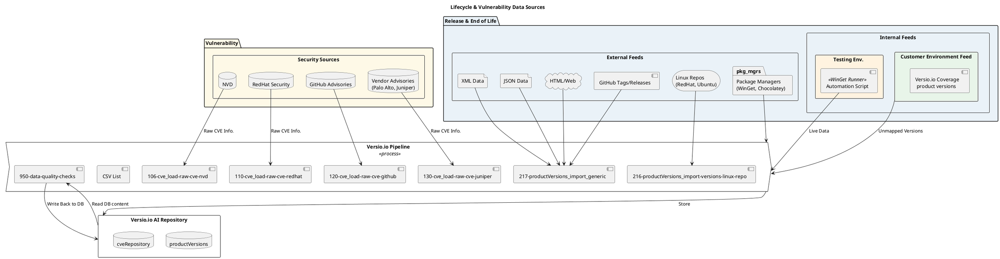

#### 1.2. Analyse der API-Schnittstelle und Anforderungen
Die API verlangt, dass eine ID nummber, displayName, description soll mitgeschickt werden. ausswerdem soll eine api rate hochsten 5000 pro sekunde soll nicht überschreiben werden. die api ist eine private rest api die uber eine API token erreichbar ist. weil es eine rest api ist, implmentiere ich entweder calls mit put oder post methode, das wird entschieden wenn die anforderugnen an das api call in dem lastenheft defineirt sind.

#### 1.3 Festlegung des standardisierten SQL-Formats

Das system soll eingegebene sql datien lesen, verabieteen und an api schiecken. Das bedutet die sql datiten müssen eine bestimete strukture folgen, damit der system sie verabiten konnen. zum beispiel es soll sicher gestellet werden, dass eine productID, name und herstellername vorhanden sein damit.

#### 1.5 Vorbereitung des Projekt-Lastenhefts
##### 1.5.1.Welche Einschränkungen müssen berücksichtigt werden?
Die bestehenden Datenbankoperationen der Plattform und die allgemeine Verfügbarkeit von Versio.io haben zu jeder Zeit Vorrang. Technisch soll sich die Lösung problemlos in die aktuelle NodeJS-Infrastruktur integrieren und direkt in die vorhandene Pipeline-Struktur eingliedern lassen. Außerdem liegt ein besonderer Fokus auf der Sicherheit, insbesondere bei der geschützten Handhabung von API-Token und Datenbank-Zugangsdaten, um die Integrität der gesamten Umgebung nicht zu kompromittieren. Dies muss durch so eine Methode realisiert werden, dass dadurch keine Sensible-Daten im Klartext im Quellcode stehen.

##### 1.5.2.Welche Einschränkungen müssen berücksichtigt werden?

* Automatische Ausführung von SQL-Queries aus SQL-Dateien, die von QA-Mitarbeitern erstellt werden.
* Verarbeitung von Prüfergebnissen (Versio.io API Konform).
* Gesicherte API-Aufrufe an die Versio.io-Plattform.
* Error-Handling für fehlgeschlagene SQL-Queries und API-Aufrufe.
* Modulare Architektur und Aufgabentrennung für einfache Erweiterung und Wartung.
* Nutzung von NodeJS, MariaDB.
* Integration in die bestehende Versio.io-Pipeline-Struktur.

Wenn die api call durch sind. Versio.io zeigt die erhaltenen calls als instancen mit iheren attributen.
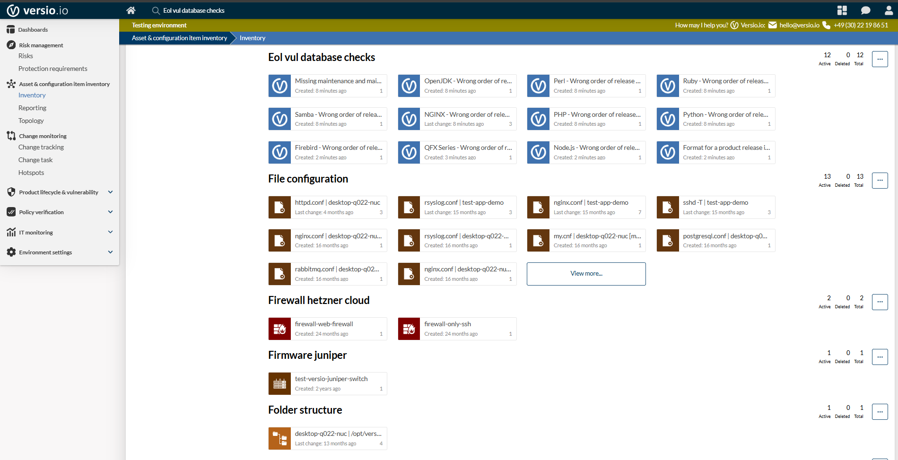

Jeder Instnace wird mit ihren attributen gezeigt, die von dem System berbeitet wurden und von sql erstellet wurden:
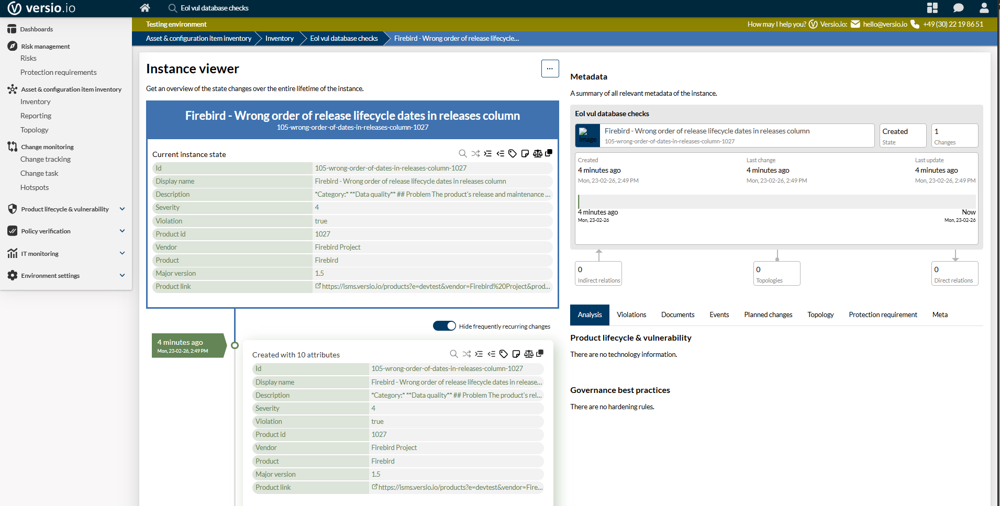

für diese instnacen wird eine policy gruppe erstellet:

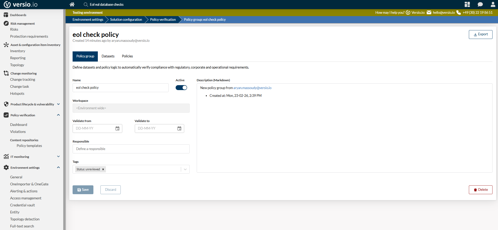

dann wird die dataset ausgewählt

dann wird die policy und ihre verfizeirende attribute selektiert:
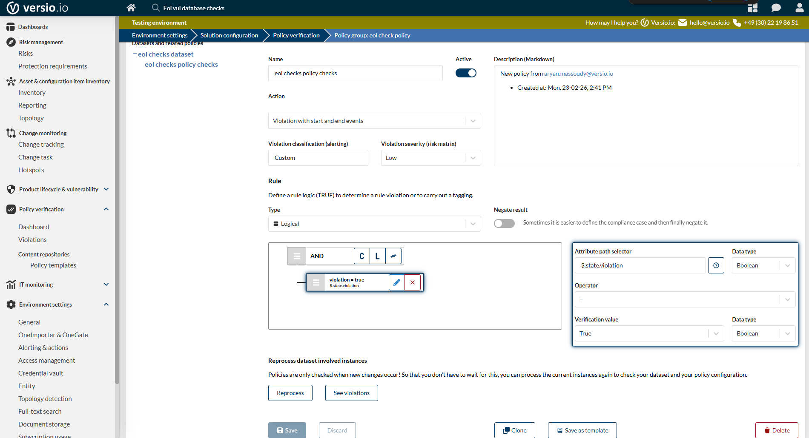
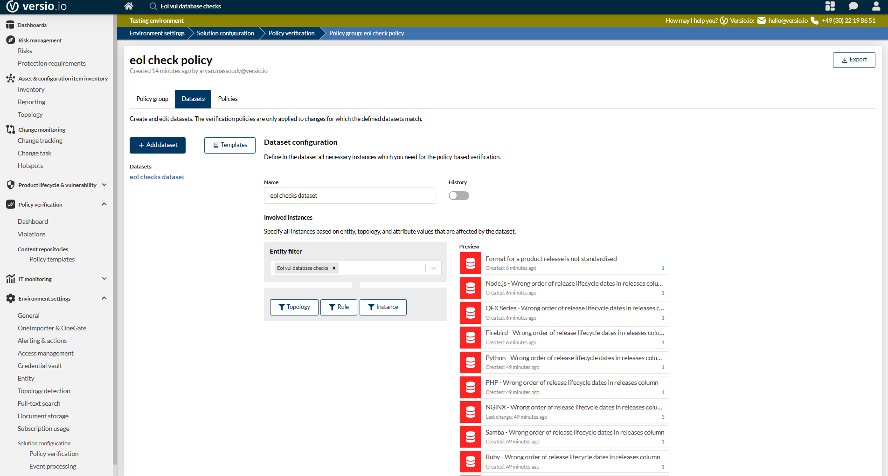

und dann wird in violations, sie gezeigt:

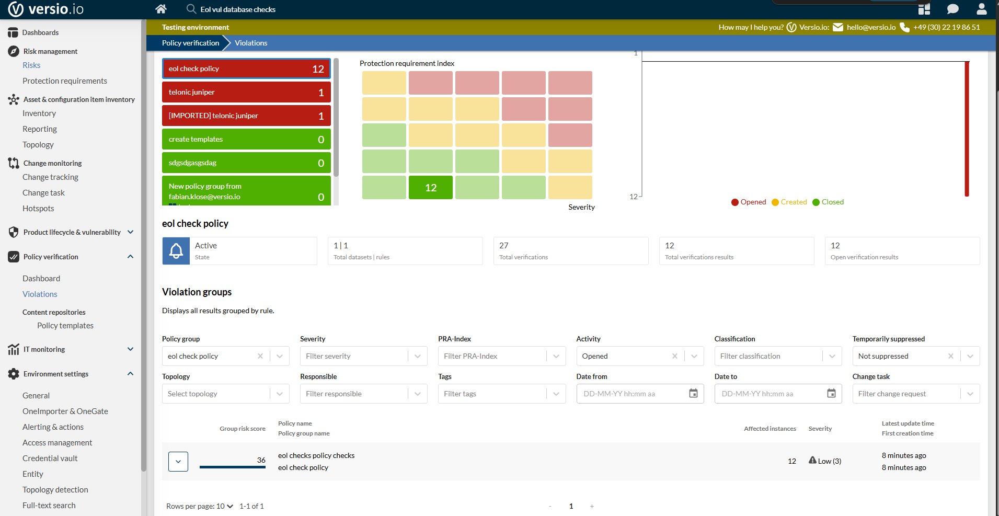

hier ist die liste:
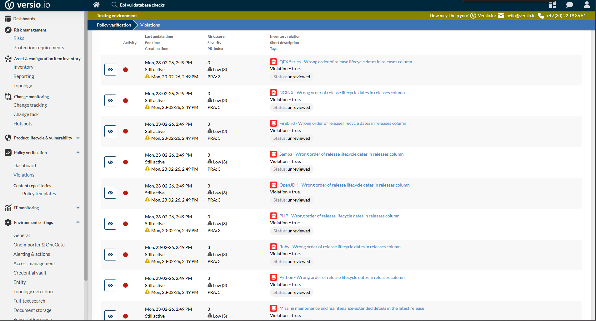

und wird fur jede davon automatisch ein event erzeugt:
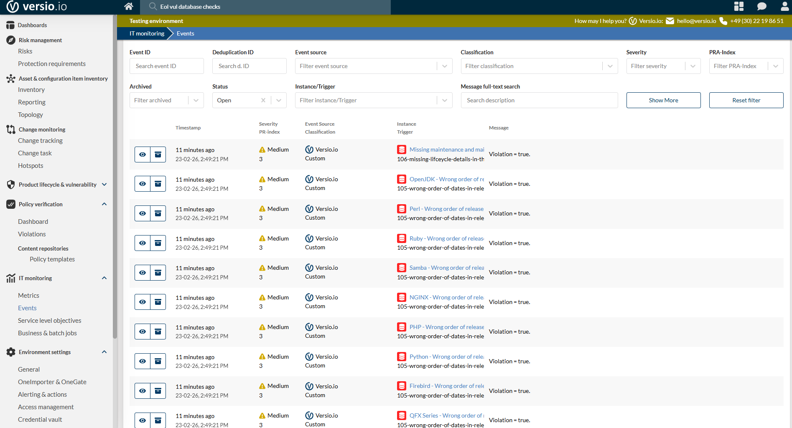

fur diese events kann man notifikation erzugen:

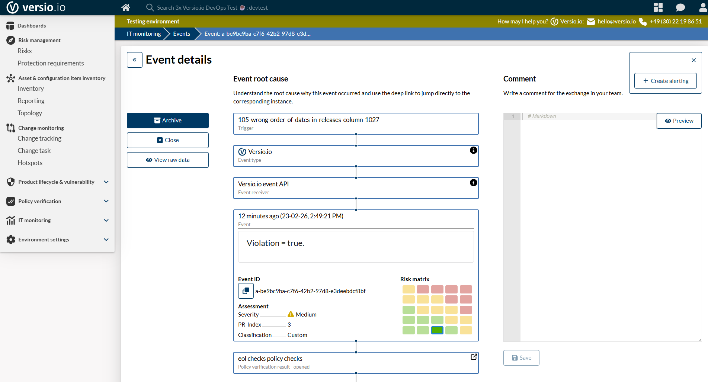

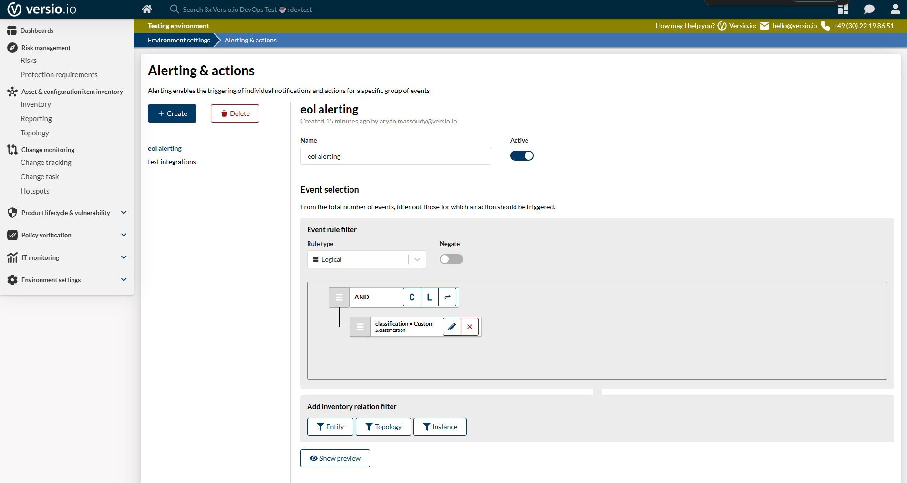

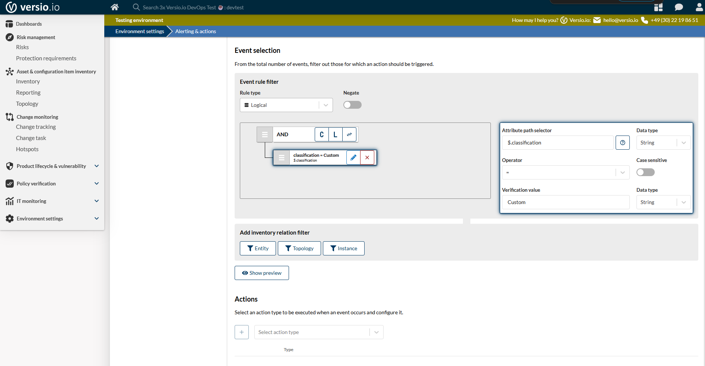

hier wird email genommen:

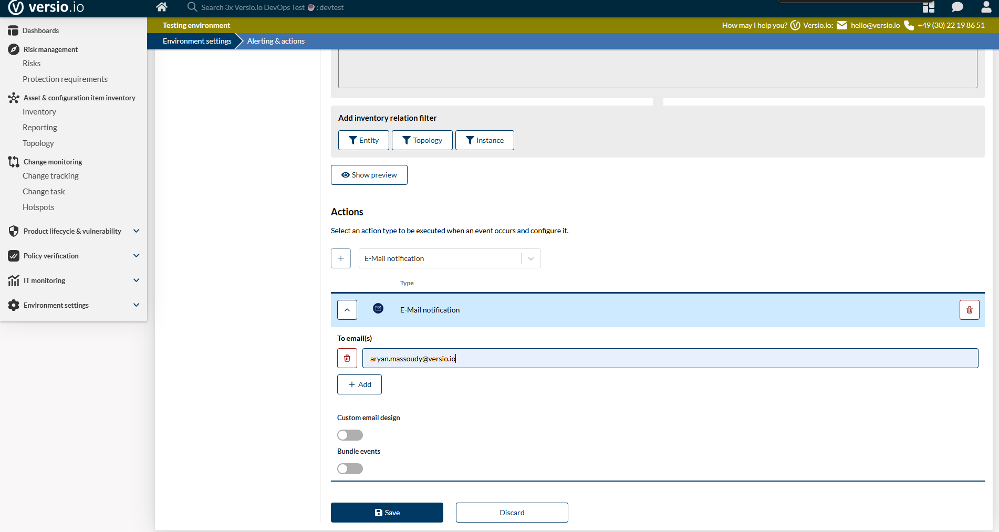

benachritigunung:
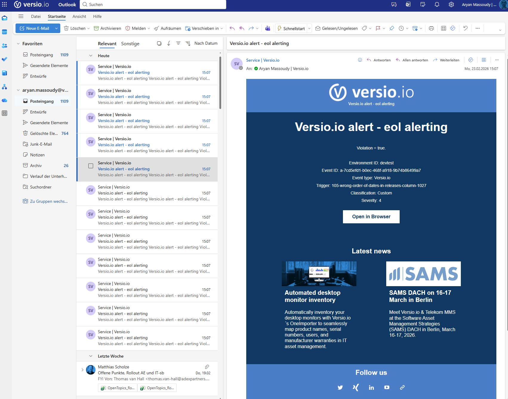