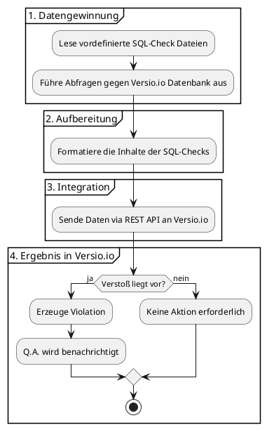
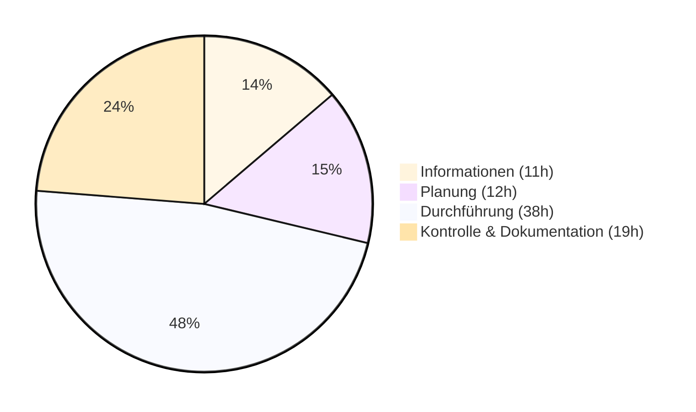

# 1. Beantragung der betrieblichen Projektarbeit

**Ausbildungsberuf:** Fachinformatiker für Anwendungsentwicklung (FIAE)

**Antragsteller:** Aryan Massoudy

**Bildungsträger:** IBB Institut für Berufliche Bildung AG

**Praktikumsbetrieb:** QMETHODS – Business & IT Consulting GmbH

**Datum:** 08.02.2026

---

## 1. Projektbezeichnung und Zeitraum

**Thema:** Entwicklung eines Qualitätsprüfungssystems für den Versio.io Produktlebenszyklus und Schwachstellen-Datenbankcontent

**Geplanter Bearbeitungszeitraum:**

* **Beginn:** Ab Antragsgenehmigung
* **Ende:** Antragsgenehmigung + 10 Tage
* **Dauer:** 80 Stunden

### 1.1. Projektumfeld und Kurzform der Aufgabenstellung

Versio.io (ein Softwareprodukt der QMETHODS – Business & IT Consulting GmbH) ist eine Plattform, die die gesamte IT-Landschaft eines Unternehmens inventarisiert. Basierend auf dieser digitalen Nachbildung (Digital Twin) werden alle Änderungen erkannt und können im Hinblick auf IT-Governance und Sicherheit bewertet werden. Neben anderen Funktionen bietet Versio.io auch eine Bewertung des Lebenszyklus und der Sicherheit von Software- und Hardwareprodukten.

Im Backend wird eine Pipeline mit mehreren Schritten genutzt. Diese sorgt dafür, die benötigten Daten für unterstützte Software- und Hardwareprodukte aus verschiedenen Online-Quellen zu kollektieren, zu bearbeiten und in der Produktlebenszyklus- und Schwachstellen-Datenbank zu speichern. Nach der Speicherung in der DB, werden die Daten für das Frontend der Versio.io-Plattform bereitgestellt, welches von Kunden genutzt wird, um ihre eigene Software und Hardware auf Aktualität und Schwachstellen zu überprüfen.

Nun soll ich die Pipeline um einen weiteren Schritt erweitern, der SQL-Queries für verschiedene Qualitätskontrollen als Datei importiert, liest und gegen die Versio.io-Datenbankinhalte ausführt. Bei gefundenen Problemen werden diese mithilfe einer API an die Versio.io-Plattform gesendet. Dort werden sie intern von Versio.io QA-Mitarbeitern korrigiert und beim nächsten Durchlauf des Pipeline-Schritts als abgeschlossen gekennzeichnet.

---

## 2. Ist-zustand

Momentan erfolgt die Datenqualitätsprüfung manuell durch QA-Mitarbeiter mithilfe von sporadischen und zeitlich zufälligen SQL-Queries. Die Ergebnisse werden dabei nicht getrackt oder dokumentiert. Dieser Ansatz ist wegen des Zeitaufwands und der Skalierungsprobleme nicht effizient, weil die manuelle Ausführung der SQL-Queries und die Überprüfung der Ergebnisse mehrere Stunden dauert. Außerdem werden die Ergebnisse nicht klar getrackt, also welche Probleme gefunden, korrigiert und abgeschlossen wurden.

---

## 3. Zielsetzung

### 3.1. Was soll am Ende des Projekts erreicht sein?

Das primäre Projektziel ist die Implementierung eines weiteren Schrittes in der Backend-Pipeline zur Datenqualitätsprüfung. Dieser soll SQL-Dateien einlesen (welche von QA-Mitarbeitern bei Bedarf geschrieben werden, um Probleme zu erkennen), um eine automatisierte Überwachung und Berichterstattung zu gewährleisten.

Ein zentraler Bestandteil ist die direkte Anbindung an die Versio.io-Plattform via API, wodurch identifizierte Qualitätsprobleme ohne manuelles Eingreifen gemeldet werden. Die Robustheit soll durch Fehlerbehandlung für Datenbank- und Schnittstellenkonflikte sichergestellt werden. Durch die Umsetzung des Projekts soll die manuelle Datenqualitätsprüfung reduziert werden, was zu Zeit- und Kosteneinsparungen führen soll.

Für eine übersichtlichere und einfachere Darstellung des Soll-Konzepts dient das folgende Flussdiagramm:
Die Schritte 1, 2 und 3 sollen implementiert werden. Schritt 4 (Versio.io), der die Daten aus dem neuen Pipeline-Schritt empfängt und weiterverarbeitet, ist breit vorhanden.

### 3.2. SQL-Dateien

Bei den "SQL-Dateien" handelt es sich um vordefinierte, separate SQL-Dateien innerhalb der Pipeline, die bei Bedarf vom Q.A Mitarbeiter geschrieben werden. Jede Datei wird eine SQL-Query enthalten, die eine spezifische Datenqualitäts-Regel prüft.

Die Queries werden dynamisch eingelesen und ausgeführt. Neue Qualitätsprüfungen sollen einfach durch Hinzufügen neuer .sql-Dateien ohne Codeänderungen möglich sein.

### 3.3. Welche Anforderungen müssen erfüllt sein?

* Automatische Ausführung von SQL-Queries aus SQL-Dateien, die von QA-Mitarbeitern erstellt werden.
* Verarbeitung von Prüfergebnissen (Versio.io API Konform).
* Gesicherte API-Aufrufe an die Versio.io-Plattform.
* Error-Handling für fehlgeschlagene SQL-Queries und API-Aufrufe.
* Modulare Architektur und Aufgabentrennung für einfache Erweiterung und Wartung.
* Nutzung von NodeJS, MariaDB.
* Integration in die bestehende Versio.io-Pipeline-Struktur.

### 3.4. Welche Einschränkungen müssen berücksichtigt werden?

Die bestehenden Datenbankoperationen der Plattform und die allgemeine Verfügbarkeit von Versio.io haben zu jeder Zeit Vorrang. Technisch soll sich die Lösung problemlos in die aktuelle NodeJS-Infrastruktur integrieren und direkt in die vorhandene Pipeline-Struktur eingliedern lassen. Außerdem liegt ein besonderer Fokus auf der Sicherheit, insbesondere bei der geschützten Handhabung von API-Token und Datenbank-Zugangsdaten, um die Integrität der gesamten Umgebung nicht zu kompromittieren. Dies muss durch so eine Methode realisiert werden, dass dadurch keine Sensible-Daten im Klartext im Quellcode stehen.

---

## 4. Projektstrukturplan mit Zeitplanung

| Phase | Aufgabe | Aufwand (h) | Summe (h) |
| --- | --- | --- | --- |
| **Informationen** | Soll/Ist- und Wirtschaftlichkeitsanalyse (Ink. Amortisationsdauer) | 3 | **11** |
|  | Analyse der Pipeline-Struktur und Architektur | 2 |  |
|  | Analyse der API-Schnittstelle und Anforderungen | 2 |  |
|  | Festlegung des standardisierten SQL-Formats | 2 |  |
|  | Vorbereitung des Projekt-Lastenhefts | 2 |  |
| **Planung** | Entwurf der UML-Diagramme (Aktivitäts- und Use-Case-Diagramm) | 2 | **12** |
|  | Entwurf der Datenbank-Anbindung | 2 |  |
|  | Ausarbeitung der Versio.io API Rate-Limiting | 2 |  |
|  | Entwurf API-Integration & Error-Handling | 4 |  |
|  | Erstellung des Pflichtenhefts | 2 |  |
| **Durchführung** | Erstellung der Struktur in der bestehenden Pipeline | 2 | **38** |
|  | Implementierung Datenbank-Anbindung | 3 |  |
|  | Entwicklung des SQL-Datei-Scanners | 3 |  |
|  | Realisierung optimierter Prozessor für API-Calls | 3 |  |
|  | Sicherstellung des Rate-Limiting-Mechanism | 3 |  |
|  | Implementierung der Logik zur Ergebnisformatierung | 3 |  |
|  | Entwicklung der API-Schnittstelle (PUT/POST-Requests) | 4 |  |
|  | Implementierung eines robusten Fehlerhandlings (Try-Catch) | 3 |  |
|  | Integration von Logging | 3 |  |
|  | Erstellung des Shell-Skript-Wrappers (main.sh) | 2 |  |
|  | Konfiguration der Umgebungsvariablen & Tokens | 2 |  |
|  | Code-Refactoring und Optimierung | 3 |  |
|  | Erstellung von Beispiel-SQL-Queries | 4 |  |
| **Kontrolle & Dok.** | Code-Review durch das Entwicklungsteam | 2 | **19** |
|  | Platzierung in die bestehende Pipeline | 1 |  |
|  | Erfolgskontrolle in der Entwicklungsumgebung und Whitebox Test | 1 |  |
|  | Soll- Ist- Vergleich | 1 |  |
|  | Abnahme durch Projektverantwortliche | 1 |  |
|  | Erstellung der Projektdokumentation (prozessorientiert) | 10 |  |
|  | Erstellung der Entwicklerdokumentation | 2 |  |
|  | Erstellung des Benutzerhandbuchs | 1 |  |
| **Gesamt** |  |  | **80** |

### 4.1. Ressourcen

* **Human-Resources:** Antragsteller (Auszubildender) + Herr Matthias Scholze (CTO, Mentor)
* **Infrastruktur:** Büroarbeitsplatz- und rechner, Node.js, MariaDB-Datenbank
* **API-Zugang:** Versio.io API Token
* **Entwicklungsumgebung:** Windows, VS Code, Git
* **Dokumentation:** Bestehende Versio.io Backend Pipeline-Dokumentation

---

## 5. Geplante Dokumentationsmittel

Die Dokumentation erfolgt als prozessorientierter Projektbericht (ca. 15 Seiten). Als Anlagen sind Auszüge aus dem Lastenheft und Pflichtenheft, Code-Snippets sowie Testprotokolle vorgesehen.

---

## 6. Präsentationsmittel & Rüstzeiten

* **Präsentationsmittel:** Laptop mit installierter Präsentationssoftware (z. B. PowerPoint), Beamer/Monitor.
* **Rüstzeiten:** Für den Aufbau und Funktionstest der Hardware sowie der Medien sind 5 Minuten vor Beginn der Präsentation eingeplant.

---

## 7. Projektverantwortlicher

Herr Matthias Scholze Chief Technology Officer at Versio.io

QMETHODS – Business & IT Consulting GmbH

Stargarder Str. 10, 10437 Berlin

matthias.scholze@versio.io

---

## 8. Hinweise

Hiermit wird bestätigt, dass dieser Antrag dem Ausbildungsbetrieb gezeigt wurde und für die Ausbildenden akzeptabel ist. Der Projektantrag enthält keine schutzwürdigen Betriebs- oder Kundendaten. Außerdem bestätige ich mit dem Einreichen des Antrags, dass ich diesen eigenständig angefertigt habe.